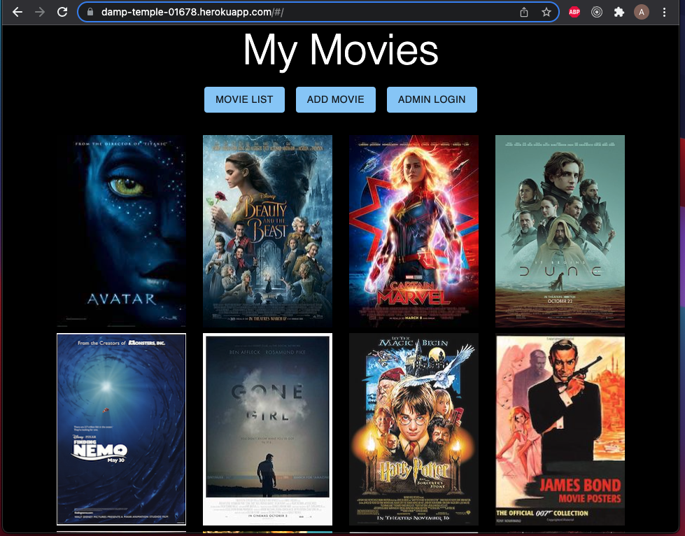
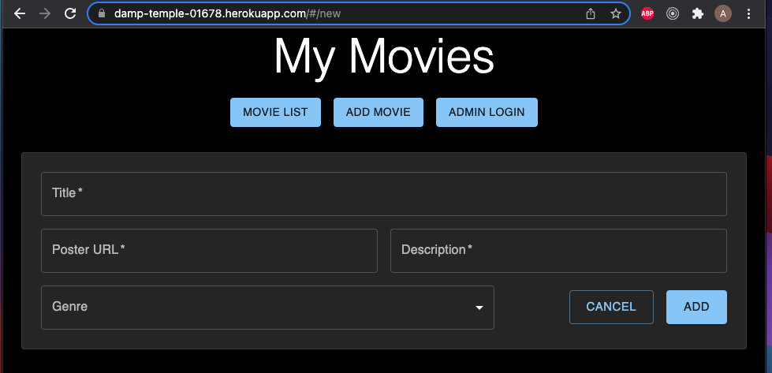
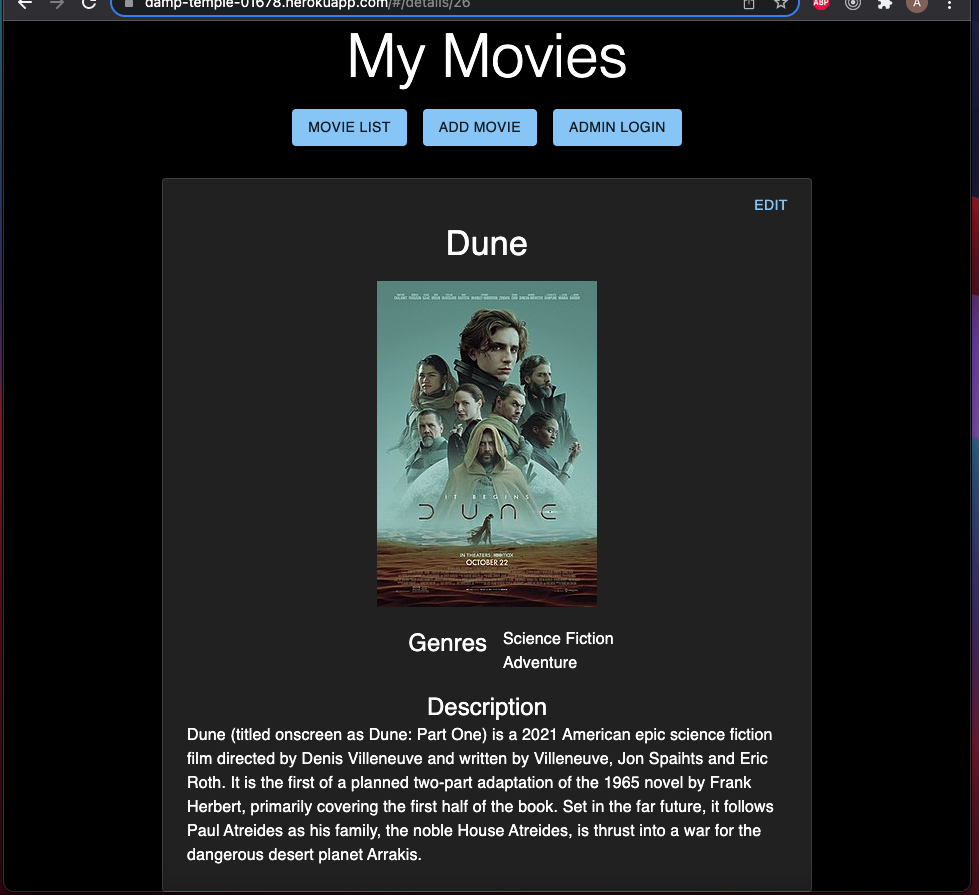
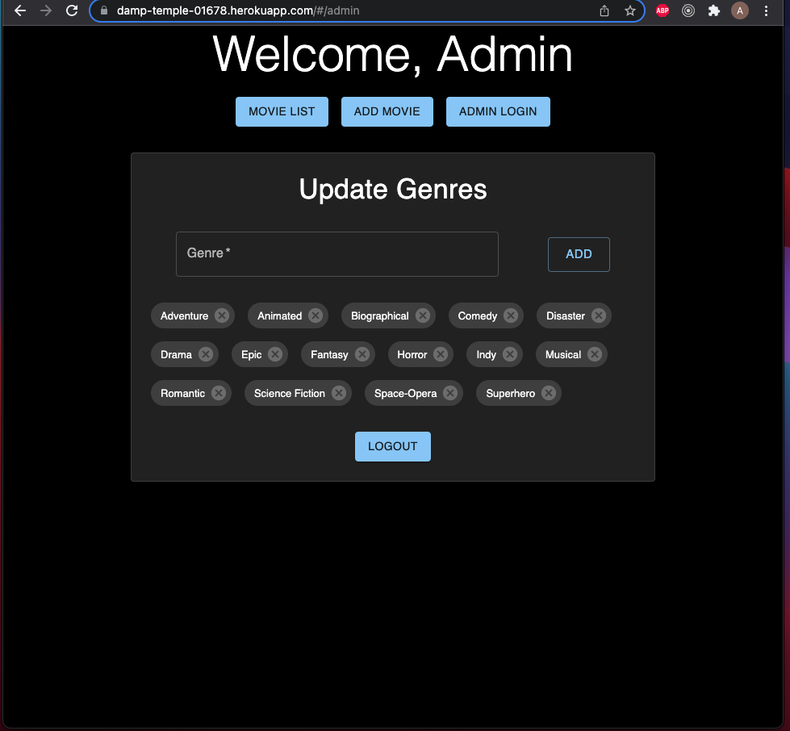

# PROJECT NAME

Movie Collection Manager

## Description

_Duration: Weekend_

This is a full stack application for managing a movie collection. The main page is a view of movie posters in the collection. There is a details page for each movie which displays the movie's title, poster, genres, and description. Title, descriptions, and genres may be edited by the user. Users may also add new movies to the collection on the Add Movie page. The Admin view allows the user to update the master list of genres: genres may be added or removed.

The app uses React Redux and Sagas to get data from the database and store the data in state. The Details page uses react-router url params, so the user may refresh the page and not lose the information. One of the challenges in the this project was working with the asynchronus functions and rendering with their returns. For example, if the user refreshes the page while editing a movie, the inputs are no longer populated with the current values.

A junction table is used in the database in order to make many to many relations between the lists of genres and movies. This brought about two challenges. First, allowing the user to add more than one genre to a new movie. Second, allowing the user to edit an existing movie's genres. The first problem was solved on the server by looping over the desired genres to build a INSERT query string. The second was solved by first deleting the existing movie/genre realations and then using the same INSERT query method to add the new and/or previous relations back.

View the deployed version of the app on [Heroku](https://damp-temple-01678.herokuapp.com/)

TODO

- [x] Allow the user to add more than one genre to a new movie
- [x] Allow the user to add or remove a genre on the Edit page
- [ ] Implement a search function to search for movies in the collection
- [x] Develop an Admin page for adding and removing genres from the database
- [x] Deploy to Heroku

## Screenshots

### Prerequisites

- [Node.js](https://nodejs.org/en/)
- [PostgreSQL](https://www.postgresql.org/)

## Installation

1. Create a database named `saga_movies_weekend`,
2. The queries in the `data.sql` file are set up to create the necessary table and populate it with some starter images. [Postico](https://eggerapps.at/postico/) is recommended as that was used to create the queries,
3. Open up your editor of choice and run `npm install`
4. Run `npm run server` in your terminal to start the server with `nodemon`
5. Run `npm run client` in your terminal to open the client in your browser

## Usage

How does someone use this application? Tell a user story here.

1. View the movie collection on the Home page.
2. Click `Add Movie` to navigate to the form to add a new movie.
3. Enter the movie's title, a url for the poster image, a description, and a genre.
4. Click `Add` to save to the database, or `Cancel` to discard and return Home.
5. Click on a movie's poster to navigate to the Details page for that movie.
6. Click `Edit` to edit the movie's title, description, and/or genres.
7. Click `Save` to update the database entry, or `Cancel` to discard and return to Details.
8. Click `Admin Login` to view the Admin page (username: `camera`, password: `action`).
9. On the Admin page, new genres may be added and removed.

## Built With

- React
- Redux
- Saga
- Node.js
- Express.js
- PostgreSQL
- Material UI v5

## Acknowledgement

I would like to thank [Prime Digital Academy](www.primeacademy.io) and [Dane Smith](https://github.com/DoctorHowser)

## Support

If you have suggestions or issues, please email me at [austin4191@gmail.com](www.google.com)
